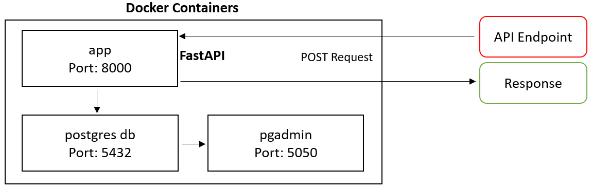
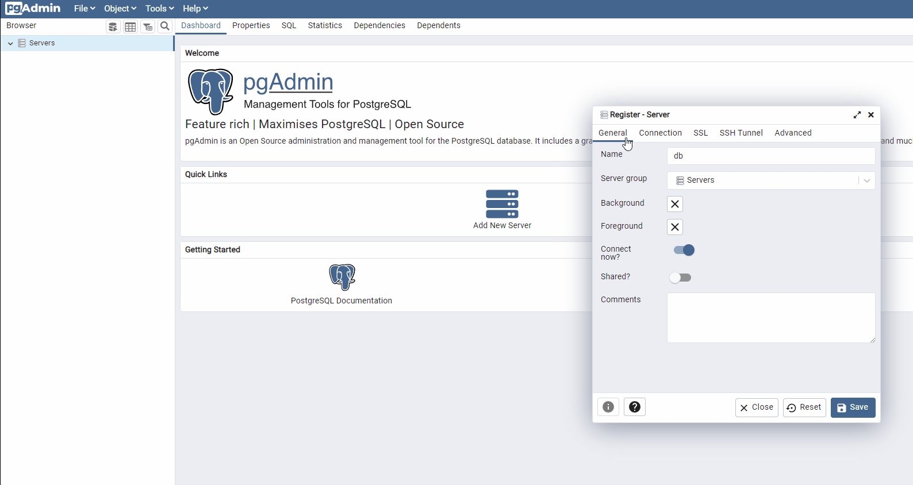
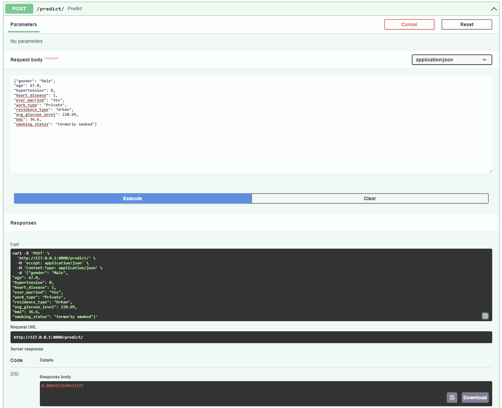
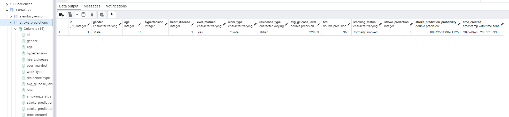

## Project Overview

A repository which trains a machine learning pipeline to predict whether a patient is likely to get stroke based on the input parameters like gender, age, various diseases, and smoking status. The machine learning pipeline is served using FastAPI where records are stored within a PostgreSQL database.

## Repository Structure

```
├── app                              <- FastAPI code.
│   ├── alembic                      <- Database migration code.
│   ├── src 
│   │   ├── pipelines                <- Model pipelines.
│   │   └── train_pipeline.py        <- Training pipeline script.
│   ├── .env                         <- Environment file.
│   ├── docker-compose.yml           <- Docker compose file.
│   ├── Dockerfile                   <- Docker file.
│   ├── main.py                      <- FastAPI entry script.
│   ├── models.py                    <- Database models.
│   ├── requirements.txt             <- Python library requirements file.
│   └── schema.py                    <- API request schemas.
│
├── data                             <- Datasets are stored here.
│
├── docs                             <- Documentation directory.
│   └── images                       
│ 
├── notebooks                        <- Example notebooks and pipeline training scripts.
│ 
├── tests                            <- Training and deployment tests.
│
├── .gitignore                       <- Git ignore.
├── README.md                        <- Repository README.md file.
└── requirements.txt                 <- Python library requirements file.
 ```

## System Architecture Overview



## Application Setup

#### Step 1: Clone Repository

Run ```git clone https://github.com/deepbakes/sklearn-pipeline-deploy.git```

<br>

#### Step 2: Build and Start Docker Containers

Change directory into the ```app``` directory by running the ```cd /app``` command.

First you must build the Docker containers by running ```docker-compose build```. Then the Docker containers can be started by running ```docker-compose up```. You can check that the containers are running by entering ```docker ps -a``` within the terminal. Alternatively, if you have Docker Desktop installed you can see that the ```postgres_db```, ```pgadmin``` and ```app``` Docker containers are running.

<br>

#### Step 3: Complete Database Migrations

Now we must create the Postgres database tables by running a database migration using the ```alembic``` Python library. First you should run ```docker-compose run app alembic revision --autogenerate -m "New Migration"``` to create database migration which is stored within ```alembic/versions/```. Afterwards, you can move the database migration by running ```docker-compose run app alembic upgrade head```.

<br>

#### Step 4: Configure pgAdmin

We can now setup the pgAdmin connection to the server using the credentials provided within the ```.env``` file.



<br>

#### Step 4: Test API

We can ensure that the API is working correctly by using the FastAPI Swagger interface by navigating to ```http://127.0.0.1:8000/docs```.

<br>

The Swagger interface allows us to send a JSON payload to FastAPI by using a POST request. We can demonstrate how the API responds by sending a JSON payload and inspecting the response.



<br>

We can also check that this dummy payload has saved to the Postgres database correctly by logging into pgAdmin 4 by navigating to ```http://127.0.0.1:5050```.

